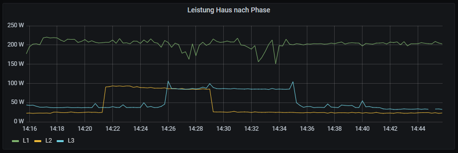

# OBIS Exporter

An ESP8266 based exporter of [Prometheus](http://prometheus.io/)/[OpenMetrics](https://openmetrics.io/) data from OBIS messages received from a smart meter infrared interface.

## When to use this project

Using the same circuit design as described in https://github.com/mruettgers/smlreader one can receive data transmitted by smart meters via infrared outputs.

However, some smart meters do not blink in the SML protocol, but instead blink raw OBIS messages in ASCII plain text.
This applies to at least:
+ [eBZ DD3 "OD type"](https://www.manualslib.de/manual/409099/Ebz-Dd3.html?page=11#manual)
+ EasyMeter ESY11 Q3DA1002 V3.04

See [this comment](https://github.com/mruettgers/SMLReader/issues/46#issuecomment-1366027583) for more information.

## Set Up

After flashing a Wemos D1 mini* using [PlatformIO](https://platformio.org/), the device spins up a WiFi hotspot "OBISExporter" to which you can connect without a password.
In the form, you'll have to set a password for the default WiFi hotspot, and enter your SSID and password for your regular WiFi.

*If you want to use something other than a Wemos D1 mini, make sure to change the `board` setting in the `platformio.ini` file.

After setting the configuration, the device should connect to your WiFi, and run a webserver exposing Prometheus metrics under `http://<ip_or_fqdn>/metrics`.

This can be scaped by Prometheus, and visualized in Grafana:

## FAQ

__Why not send MQTT messages?__

We wanted this data to end up in Prometheus to make visualization with [Grafana](http://grafana.com/) as easy as possible.
With MQTT we'd have to run several more services (MQTT broker, NodeRED) to get the data into a database.

Also, the `<ip_or_fqdn>:80/metrics` endpoint can be viewed in a browser, which is very convenient.

__I'm not receiving infrared data__

Some smart meters such as the eBZ DD3 have more than one IR output.

On the eBZ DD3 we got more consistent transfer quality from the IR port at the top.

Also remember to activate the IR output as described in the smart meter manual.
